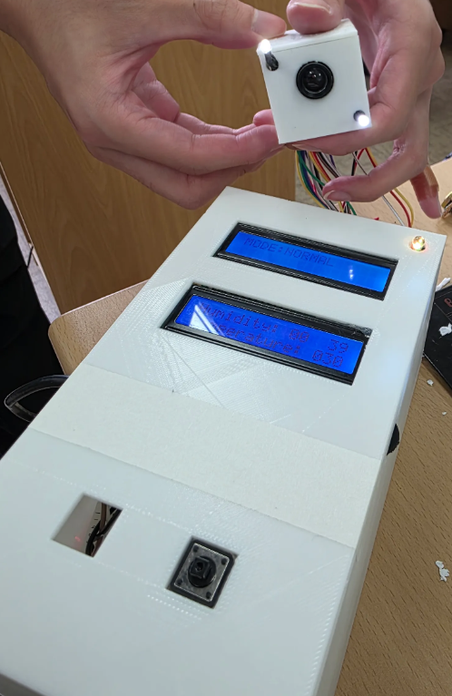
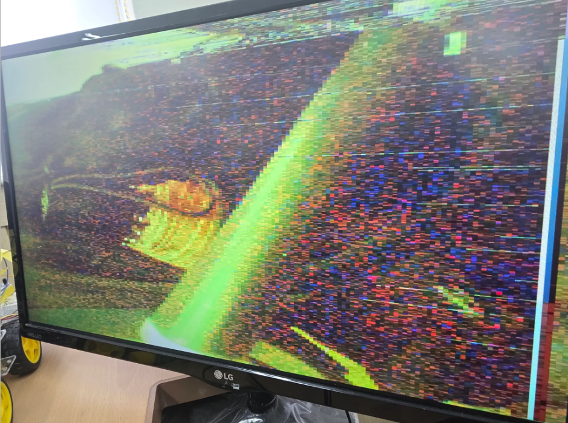
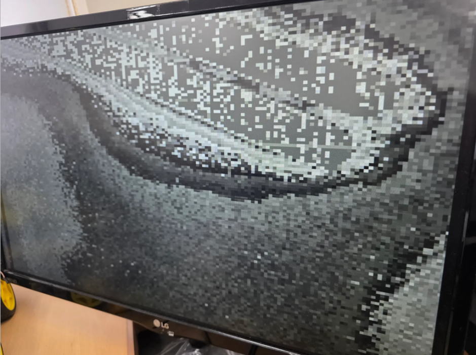
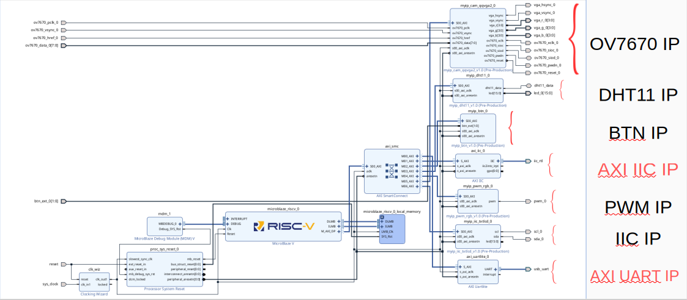
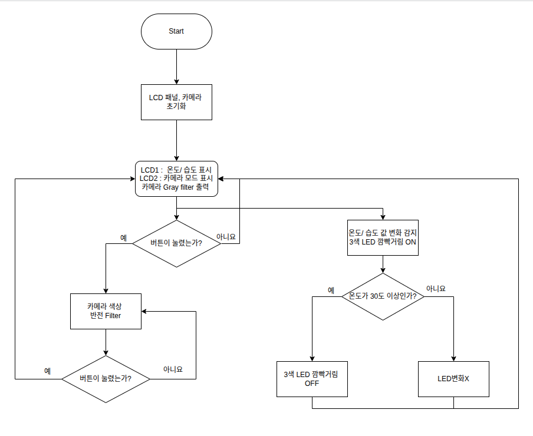

# 📷 Multipurpose - Camera 프로젝트 – Basys3 & SoC System

Basys3 FPGA 보드와 OV7670 카메라를 활용한 **다목적 카메라 시스템**입니다.  
VGA 출력, 환경 센서 표시, LED 제어, LCD 표출 등을 통합해 SoC 기반으로 구현하였으며, 하드웨어·소프트웨어 통합 설계 경험을 목표로 했습니다.  

 
  <a href="#-프로젝트-개요">프로젝트 개요</a> • 
  <a href="#-skill-stack">Skill Stack</a> • 
  <a href="#-외관 / 모니터 화면">외관 / 모니터 화면</a> •
  <a href="#-diagram--flow-chart">Diagram & Flow Chart</a> •
  <a href="#-주요-기능">주요 기능</a> • 
  <a href="#-사용-부품">사용 부품</a> • 
  <a href="#-trouble-shooting">Trouble Shooting</a> • 
  <a href="#-개선사항--추가해야-할-점">개선사항 / 추가해야 할 점</a> •
  <a href="#-시연-영상">시연 영상</a>

---

## 📌 프로젝트 개요
- **보드/언어**: Basys3, Verilog, VHDL, Embedded C  
- **핵심 목표**
  - 소형 다목적 카메라 시스템 구현  
  - 실시간 영상 출력 (VGA)  
  - 환경 정보 표시 (온·습도 센서 → TEXT LCD 출력)  
  - 카메라 모드 전환 (Grayscale ↔ 컬러 반전)  
  - 밝기 조절(백색 LED + 가변저항), 온도 알림(3색 LED)  
  - SoC 설계를 통한 하드웨어·소프트웨어 통합  

---

## 🛠 Skill Stack

---

## ✨ 외관 / 모니터 화면

---

## 📊 Diagram & Flow Chart

- **구성 요소**  
  - OV7670 Camera  
  - Basys3 FPGA 보드  
  - LCD (ILI9341) - 카메라와 연동 X 
  - TEXT LCD 
  - VGA 출력  
  - 온습도 센서 (DHT11)  
  - 3색 LED / 백색 LED / 가변저항  

  
  

---

## ✨ 주요 기능
- **카메라 모드**  
  - 기본 Grayscale → 버튼 입력 시 컬러 반전  
- **환경 정보 LCD 출력**  
  - 온도·습도 센서(DHT11) 값 실시간 표시  
- **VGA 영상 출력**  
  - OV7670 카메라 입력을 실시간 VGA로 송출  
- **밝기 조절**  
  - 백색 LED + 가변저항으로 화면 밝기 제어  
- **온도 알림**  
  - 3색 LED를 활용한 임계 온도 표시  
- **SoC 적용**  
  - 하드웨어 + 소프트웨어 통합  
  - 빠른 업데이트 및 센서 확장 가능  

---

## 🔧 사용 부품
- **보드**: Basys3 (Xilinx Artix-7 FPGA)  
- **카메라**: OV7670  
- **LCD**: ILI9341  
- **센서**: DHT11 (온습도)  
- **출력 장치**: VGA Cable, LCD, LED  
- **제어 장치**: 가변저항, 버튼  

---

## 🔧 Trouble Shooting
- **문제 1: LCD 출력 지연**  
  - ILI9341 초기화 시퀀스 오류 + 배선 실수  
  - ✅ 해결: 초기화 명령 재설정 및 회로 재배선  

- **문제 2: 카메라 데이터 전송 불안정**  
  - OV7670 클럭 세팅 문제  
  - ✅ 해결: PLL 활용하여 안정적 픽셀 클럭 생성  

- **문제 3: 센서 데이터 갱신 속도 문제**  
  - DHT11 응답 지연 → 실시간 LCD 갱신 어려움  
  - ✅ 해결: 인터럽트 기반 데이터 처리 적용  

---

## 🔧 개선사항 / 추가해야 할 점
- **LCD 패널 추가**  
  - 더 큰 해상도의 LCD 패널을 적용해 가독성과 활용성 강화  
- **무선 통신 기능**  
  - Wi-Fi 또는 Bluetooth 모듈을 추가해 원격 모니터링 및 제어 기능 제공  
- **저장 기능**  
  - MicroSD 카드 모듈을 활용해 촬영 영상 및 센서 데이터를 저장 가능하도록 확장  

---

## 🎥 시연 영상
[프로젝트 시연 영상](https://youtube.com/shorts/44UNXgDKXEU?si=RZYBUyKOmBKGOu6d)
